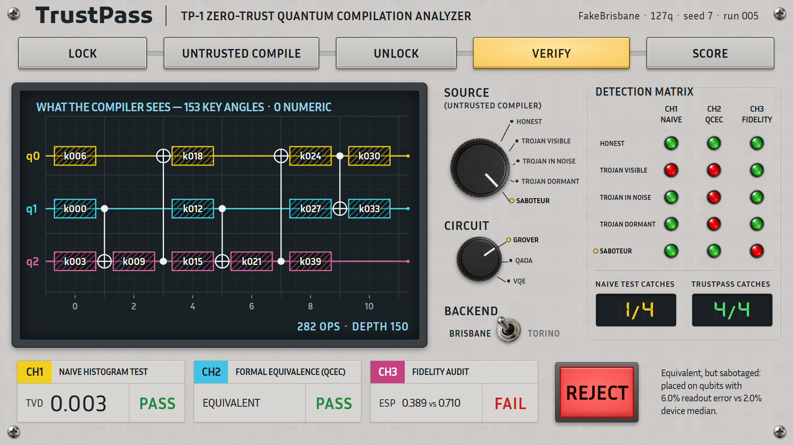
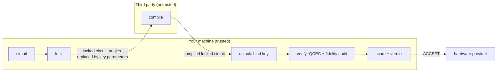

# TrustPass

**Zero-trust compilation for quantum circuits: lock the circuit before an untrusted compiler sees it, then check that what comes back is the same circuit and does not run measurably worse than a free local compile.**

Q-HACK INDIA 2026 (IBM Qiskit Fall Fest), Quantum Security & Cryptography track. Round 1 prototype.

```bash
pip install -r requirements.txt   # Python 3.12; full setup under Quickstart below
python demo.py --matrix           # the detection matrix: which check catches which attack
python test_trustpass.py          # 9 checks
python server.py                  # the live instrument UI: http://localhost:8600
```

**Stack:** Qiskit 2.5 · Qiskit Aer · MQT QCEC 3.10 · IBM fake backends with real calibration data · hand-built HTML/CSS/JS UI.

**Try it in your browser: https://abijith-kumar-sinha.github.io/TrustPass/** (a snapshot of real pipeline runs, nothing to install; run `python server.py` locally for live runs).



The interface is a bench instrument: put a circuit on the panel, turn **SOURCE** to pick the untrusted compiler, and read three channels. Every number on it comes from a real run of the pipeline below. Run it locally with `python server.py` (live runs), or open the static snapshot (`index.html` + `web/snapshot.json`, precomputed by the same pipeline) on any static host.

## The problem

The compiler is increasingly someone else's code, and the compiled circuit comes back to you before it runs:

- **Third-party transpiler plugins.** Through Qiskit's [plugin interface](https://quantum.cloud.ibm.com/docs/en/api/qiskit/transpiler_plugins), any pip package can supply the layout, routing, translation, optimization or synthesis stage of `transpile`. Malicious packages are a documented supply-chain problem: PyPI handled more than 2,000 malware reports in 2025 ([PyPI 2025 in review](https://blog.pypi.org/posts/2025-12-31-pypi-2025-in-review/)).
- **Remote compile services.** IBM's Qiskit Transpiler Service ([`TranspilerService`](https://quantum.cloud.ibm.com/docs/en/api/qiskit-ibm-transpiler/transpiler-service-transpiler-service)) sends the circuit to a cloud endpoint and returns the transpiled circuit.

Platforms that both compile and run are a different case, for example full-stack clouds such as QpiAI's (built around India's 25-qubit [QpiAI-Indus](https://www.businesswire.com/news/home/20250415961497/en/QpiAI-Announces-Dawn-of-Quantum-Era-in-India-With-25-Qubit-Quantum-Computer)). If such a platform returns the compiled circuit before running it, TrustPass still checks integrity and fidelity, but it cannot keep the circuit secret from the party that runs it.

To our knowledge no real-world malicious quantum compiler has been publicly reported. An untrusted compiler is the threat model the research below assumes. The compiler sees the whole circuit, so it can:

1. **Steal it.** The circuit is the IP: a Grover oracle's marked item, a QAOA graph with its trained angles, a VQE ansatz with its trained weights.
2. **Plant a Trojan.** Add a gate that changes the answer, either small enough to hide in hardware noise or dormant until the circuit gets a non-|0...0⟩ input ([John et al.](https://arxiv.org/abs/2502.08880)).
3. **Sabotage fidelity.** Return a circuit that is logically equivalent but parked on the worst qubits and padded with self-cancelling gates. Every equivalence checker says "equivalent"; the results just get worse.

What most users do today is run the circuit on |0...0⟩ and eyeball the histogram. In our runs that check catches the overt Trojan but misses the dormant Trojan and the saboteur on every demo, and misses the masked Trojan on Grover every time (see the detection matrix below).

## Research gaps

| # | Work | What it shows | What TrustPass does about it |
|---|------|---------------|------------------------------|
| 1 | E-LoQ, Liu, John, Wang, IEEE HOST 2025 ([arXiv:2412.17101](https://arxiv.org/abs/2412.17101)) | Locking is evaluated for concealment only; nothing checks the circuit that comes back. | Locking plus a formal equivalence check and a fidelity audit of the returned circuit. |
| 2 | CLOAQ, Langford et al., ISCAS 2026 ([arXiv:2602.23569](https://arxiv.org/abs/2602.23569)) | Prior obfuscation was evaluated only with all-\|0⟩ inputs. | Wrong-key leakage is also measured on Haar-random input states; the equivalence check covers every input. |
| 3 | Zhang & Liu, "Security Evaluation of Quantum Circuit Split Compilation under an Oracle-Guided Attack" ([arXiv:2511.04842](https://arxiv.org/abs/2511.04842), Nov 2025) | A few input/output pairs recover split-compiled circuits; new schemes need security evaluation. | Measured, not defended: in our red team, the outputs of 6 inputs fit the whole key of a 2-qubit QAOA (see limitations). Out of our threat model, since the compiler never sees results; a defence is Round 2. |
| 4 | Rahman, Haghparast, Mikkonen, "On the Figures of Merit for Quantum Software Security: Toward a Benchmarking Rubric" ([arXiv:2608.05831](https://arxiv.org/abs/2608.05831), Aug 2026) | TVD/DFC metrics are ad hoc and incompatible across papers. | One fixed scorecard for every run: confidentiality, integrity, quality, cost. |
| 5 | John, Golla, Wang, "Quantum Trojan Insertion: Controlled Activation for Covert Circuit Manipulation" ([arXiv:2502.08880](https://arxiv.org/abs/2502.08880), 2025) | Trojans can stay dormant until a specific input triggers them. | A dormant Trojan is one of our attack modes; it passes the \|0⟩ test and is caught by the equivalence check. |
| 6 | Zheng, Shang, Tan, "A Dual-Mode Quantum Circuit Trojan Attack Detection Scheme Based on Unitary Matrix Features", CQCC 2025, Springer CCIS 2026 ([doi:10.1007/978-981-95-4791-3_6](https://doi.org/10.1007/978-981-95-4791-3_6)) | A CNN classifies circuits as Trojaned or clean from their unitary-matrix features: 91.6% accuracy on 1,550 benchmark circuits, so some circuits are misclassified. | Formal equivalence checking with [MQT QCEC](https://github.com/cda-tum/mqt-qcec) (Burgholzer & Wille): a proof for the circuit at hand, not a classifier with an error rate. Scaling beyond our small demos is not yet measured. |
| 7 | MacNeil, Sunkavilli, Yu, "Authenticating Quantum Circuits Through Localized Noise Fingerprints", QSec '25 (ACM CCS workshop) ([doi:10.1145/3733825.3765283](https://doi.org/10.1145/3733825.3765283)) | Proposes, as a forward-looking concept, comparing a circuit's output distribution (TVD) on an untrusted quantum computer with a trusted noise fingerprint, using diagnostic ancilla qubits, to detect structural tampering such as gate reordering or injection. | Checks the returned circuit before it runs, with no extra qubits: QCEC for structural tampering, and an ESP audit for equivalence-preserving sabotage, in the same pipeline as locking. |
| 8 | Broadbent, Fitzsimons, Kashefi, "Universal Blind Quantum Computation", FOCS 2009 ([arXiv:0807.4154](https://arxiv.org/abs/0807.4154)) | Hides inputs, outputs and the computation from the server, but the client must prepare single qubits and run an interactive measurement-based protocol. | Works on today's circuit-model toolchains with no quantum client, and hides less: the CX skeleton stays visible (see limitations). |
| 9 | Saki, Suresh, Topaloglu, Ghosh, "Split Compilation for Security of Quantum Circuits", ICCAD 2021 ([doi:10.1109/ICCAD51958.2021.9643478](https://doi.org/10.1109/ICCAD51958.2021.9643478)) | Splits the circuit and sends the parts to several compilers, or to one compiler at different times, so no single compile sees all of it. | One compiler sees the whole locked circuit; the key keeps the angles secret, and the returned circuit is verified. Gap 3 is an attack on split compilation. |

To our knowledge, no prior tool combines locking, functional verification and a fidelity audit in one pipeline.

## How TrustPass works

Threat model: the compiler is untrusted, your machine is trusted. You bind the key and submit the final circuit to the hardware provider, a different party; the compiler never sees execution results.



1. **Lock** (`lock.py`). The circuit is rewritten as CX gates plus exactly one keyed block per wire segment, `rz(k) sx rz(k') sx rz(k'')`. Every rz angle is a `Parameter`; the values are the key and never leave your machine. The CX skeleton is flattened too:
   - *Uniform pair counts.* Decoy `cx cx` pairs (the identity) are spliced into the gate stream at random positions and locked like any real gate, until every qubit pair carries the same number of CX gates. A real two-qubit interaction and a decoy both look like CX-block-CX, and counting CX per pair no longer reveals the interaction graph. `decoys=k` adds k extra padding rounds on top (default 0).
   - *Random CX direction.* Every CX is flipped with probability 1/2; the H⊗H that the flip needs is absorbed into the neighbouring keyed blocks, so it adds no gates to the locked circuit.
   - *Nothing else leaves.* The locked circuit is named `locked`, has empty metadata and global phase 0.
   - *Fresh randomness.* Decoy positions and CX directions come from OS entropy on every lock. The `seed` in `pipeline.py`, `demo.py` and the app only fixes the transpiler.

   Grover-3 becomes 153 key angles and 24 visible CX gates and needs no decoys (its 3 qubit pairs already carry 8 CX each). QAOA-4 needs 1 decoy pair, VQE-4 needs 3.
2. **Untrusted compile** (`compilers.py`). Five stand-in compilers, all of which only ever see the locked circuit: `honest` (Qiskit `transpile`, optimization level 3), `trojan-overt` (X before measurement), `trojan-masked` (rz(0.35) mid-circuit), `trojan-dormant` (CX at t=0 between two data qubits: a no-op on |0...0⟩), `saboteur` (qubits at the device's 90th error percentile, skipping broken ones, plus 2 self-cancelling two-qubit gate pairs).
3. **Unlock.** Bind the key into the compiled circuit, locally.
4. **Verify** (`verify.py`). Three checks:
   - *naive test*: what users do today. Ideal-simulator histogram on |0...0⟩, pass if TVD < 0.10.
   - *equivalence*: first, every classical bit must be measured from the same logical qubit as in the original (through the compiler's final layout); then MQT QCEC proves the returned circuit implements the same unitary (up to global phase) for every input. Fails closed: anything QCEC cannot handle (delay, reset, feed-forward) is a REJECT.
   - *fidelity audit*: estimated success probability (ESP, the product of 1 - error over every gate and measurement, from the backend's calibration data) versus a free local honest compile of the same locked circuit. It rejects any compile measurably worse (ratio < 0.90) than a free local Qiskit compile, malicious or merely weak. It also fails closed: any gate the device cannot run on those qubits (an unknown gate, or a two-qubit gate on an uncoupled pair) is a REJECT whatever the ratio. False rejects: 0 of 360 honest compiles (3 demos × FakeBrisbane and FakeTorino × optimization levels 1-3 × transpiler seeds 0-19, each against the pipeline's level-3, seed-7 baseline), ESP ratio 0.948-1.002.
5. **Score** (`score.py`). Confidentiality, integrity and quality pillars (0-100) and one verdict: ACCEPT only if both the equivalence check and the fidelity audit pass. Confidentiality is capped at 0 if the locked circuit carries metadata or its original name, and at 50 if qubit pairs carry different CX counts.

## The detection matrix

FakeBrisbane (127-qubit Eagle noise model, ECR basis), Grover-3 with marked item `101`, transpiler seed 7. Every lock is fresh randomness, so we ran the matrix with 15 different locks: the ✓/✗ pattern was identical every time; numbers are min-max.
✓ = the check passed the circuit, ✗ = the check rejected it.

| Compiler | Naive \|0⟩ test (TVD) | QCEC equivalence | Fidelity audit (ESP ratio) | Verdict |
|----------|----------------------|------------------|----------------------------|---------|
| honest | ✓ (0.003-0.004) | ✓ | ✓ (1.00) | ACCEPT |
| trojan-overt | ✗ (0.940-0.943) | ✗ | ✓ (1.00) | REJECT |
| trojan-masked | ✓ (0.016-0.017) | ✗ | ✓ (1.00) | REJECT |
| trojan-dormant | ✓ (0.003-0.004) | ✗ | ✓ (0.99) | REJECT |
| saboteur | ✓ (0.003-0.004) | ✓ | ✗ (0.54-0.55) | REJECT |

No single check catches everything: QCEC catches every Trojan but passes the saboteur (it really is equivalent); only the fidelity audit catches the saboteur.

Which checks caught each attack, all three demos, FakeBrisbane and FakeTorino (133-qubit Heron noise model, CZ basis), 15 locks per demo per backend:

| Compiler | Grover-3 | QAOA-4 | VQE-4 |
|----------|----------|--------|-------|
| honest | none, ACCEPT | none, ACCEPT | none, ACCEPT |
| trojan-overt | naive, QCEC | naive, QCEC | naive, QCEC |
| trojan-masked | QCEC | QCEC; naive too in 3 of 40 locks | QCEC; naive too in 20 of 40 locks |
| trojan-dormant | QCEC | QCEC | QCEC |
| saboteur | fidelity audit | fidelity audit | fidelity audit |

All 90 matrices (3 demos × 2 backends × 15 locks) rejected every attack and accepted every honest compile. The masked Trojan lands at the compiled circuit's midpoint, which moves with the random lock, so its ideal-simulator TVD varies: 0.03-0.13 on QAOA and 0.02-0.13 on VQE, straddling the 0.10 tolerance (40 extra locks per demo, both backends). The saboteur's ESP ratio on FakeTorino is 0.78 (Grover), 0.61-0.71 (QAOA) and 0.54-0.67 (VQE).

A detection matrix (one lock, five compiles, no scoring) takes 0.6-3 s after imports (2 of 90 took 5 s and 11 s); a full `pipeline.run` with scorecard and noisy-sim evidence takes 3-11 s. A QCEC check took 0.02-0.34 s in 473 of 474 calls; one took 4.1 s.

## Scorecard per demo

FakeBrisbane, transpiler seed 7, no extra decoys. Each column is 16 runs (8 honest, 8 saboteur), each with a fresh lock: 8 from our first measurement and 8 re-run on 2026-10-07 with the current code. Numbers are min-max over all 16 plus the web demo's snapshot (`web/snapshot.json`, one more lock per demo), except the two rows marked * (see the first note). Confidentiality numbers come from 30 random wrong keys; "random inputs" means 5 Haar-random input states.

| | Grover-3 | QAOA-4 | VQE-4 |
|---|---|---|---|
| Secret | marked item `101` | 5-edge graph + trained angles | 24 trained weights |
| Key angles | 153 | 84 | 84 |
| Visible CX in locked circuit (decoy share) | 24 (0%) | 12 (17%) | 12 (50%) |
| CX count spread across qubit pairs | 0 | 0 | 0 |
| Wrong-key TVD, \|0⟩ input | 0.78-0.86 | 0.45-0.50 | 0.49-0.54 |
| Wrong-key TVD, random inputs * | 0.43-0.46 | 0.48-0.51 | 0.48-0.50 |
| Know-nothing reference TVD (random output state) * | 0.452 | 0.498 | 0.478 |
| Indistinguishability (1.0 = wrong key no better than knowing nothing) | 0.96-1.00 | 0.97-1.00 | 0.97-1.00 |
| Compiler's view across secrets (lock randomness held fixed) | 8 marked items → 1 identical view | 3 angle settings → 1 identical view; the graph is hidden statistically | 8 weight sets → 1 identical view |
| ESP, honest vs saboteur (ratio) | 0.71 vs 0.38-0.39 (0.54-0.55) | 0.81-0.83 vs 0.55-0.61 (0.67-0.75) | 0.80-0.83 vs 0.55-0.61 (0.66-0.74) |
| Saboteur's qubits: readout error vs device median | 0.060 vs 0.020 | 0.051 vs 0.020 | 0.051 vs 0.020 |
| Noisy-sim fidelity (1 - TVD), honest vs saboteur | 0.71-0.72 vs 0.34-0.36 | 0.90-0.91 vs 0.79-0.83 | 0.89-0.95 vs 0.77-0.84 |
| Trust pillars C / I / Q, honest | 96-100 / 100 / 100, ACCEPT | 97-100 / 100 / 100, ACCEPT | 97-100 / 100 / 100, ACCEPT |
| Trust pillars C / I / Q, saboteur | 96-100 / 100 / 54-55, REJECT | 98-100 / 100 / 67-75, REJECT | 98-100 / 100 / 66-74, REJECT |

Notes:
- \* The know-nothing reference is fixed per demo by the scoring seed's random input states. The current code gives 0.452 / 0.498 / 0.478; our first table said 0.505 / 0.477 / 0.490, which we could not reproduce, so these two rows are from the 8 re-runs only. On one lock, scoring seeds 0-2 move the reference to 0.43-0.46 (Grover), 0.46-0.54 (QAOA) and 0.48-0.52 (VQE), and the wrong-key random-input TVD moves with it; their ratio, indistinguishability, is the number to read.
- Wrong-key numbers only show that the key controls the function. Every qubit ends in a fully keyed block, so a random key looks random for any lock: those numbers cannot reveal a leak, and we no longer report "secret recovered by random keys" as evidence. The check that can fail is the view test: lock the same circuit with every secret and compare what the compiler sees. It correctly fails for QAOA graphs, whose structure is the secret.
- Indistinguishability is noisy too: on one fixed lock, scoring seeds 0-9 give 0.89-1.00 (Grover), 0.95-1.00 (QAOA) and 0.94-1.00 (VQE). With 100 wrong keys and 40 random inputs it is 1.00, 1.00 and 0.99-1.00 (two locks each, the second re-run on 2026-10-07).
- The noisy-sim fidelity is evidence, not the verdict; the verdict uses ESP from calibration data. With the trained QAOA angles (γ = 2.85, β = 0.30, a peaked output) both agree on all three demos.
- The honest ESP ratio is exactly 1.0 by construction: our stand-in honest compiler is the same `transpile` call as the local baseline.

## We red-teamed ourselves

Before submitting, we attacked our own prototype as the untrusted compiler would, knowing the code but not the key. Two rounds of independent attackers, every finding re-verified by a separate agent before we acted on it, then a final review of the verifier: 15 findings, each fixed (with a regression test where the table names one), measured, or documented below. Severity is our own judgement.

**Round 1**

| # | Severity | What it was | How we found it | Fix | Regression test (`test_trustpass.py`) |
|---|----------|-------------|-----------------|-----|----------------------------------------|
| 1 | Critical | The locked circuit kept the original name (`grover-3`) and metadata, which held the secret in plaintext; both survive `transpile`. | Read `.metadata` of the compiled locked circuit: secret recovered on 3 of 3 demos. | Locked circuit is named `locked` with empty metadata. | `test_locked_circuit_reveals_only_a_uniform_skeleton`; the scorecard also caps confidentiality at 0 |
| 2 | Medium | The locked circuit's global phase depended on the secret and leaked 1 bit of the Grover marked item (a parity of its bits). | Locked every candidate marked string offline and matched the visible phase: half the candidates eliminated. | Global phase set to 0; equivalence is checked up to global phase anyway. | `test_locked_circuit_reveals_only_a_uniform_skeleton` |
| 3 | Critical | The pipeline locked with `seed=7`, which is in this public repo, so decoy placement could be replayed. | Replayed the RNG, subtracted the predicted decoys: exact QAOA graph recovered in 100% of random graphs. | The lock always uses OS entropy; `seed` only fixes the transpiler. | `test_pipeline_never_seeds_the_lock` |
| 4 | High | Each QAOA edge and each decoy was a CX-block-CX sandwich, and decoys sat on random pairs, so sandwich counts per qubit pair exposed the graph. | Parsed sandwiches and picked the most likely edge set: exact graph recovered 0.35-0.65 of the time, versus 0.016 by chance. | Decoys pad every qubit pair to the same CX count, are spliced in and locked like real gates, and every CX gets a random direction. | `test_locked_circuit_reveals_only_a_uniform_skeleton` (pair count spread 0); the scorecard also caps confidentiality at 50 |
| 5 | High | QCEC treats unmeasured qubits as don't-care, so a compiled circuit with an output measurement deleted still passed as equivalent. | Deleted one measurement from an honest compile: QCEC said `equivalent_up_to_global_phase`. | Compare the classical-bit → logical-qubit output map (through the final layout) before QCEC. | `test_verifier_fails_closed` (dropped and re-routed measurement) |
| 6 | Medium | A single `delay` or `reset` from the compiler crashed QCEC, so the pipeline raised instead of returning a verdict (denial of service). | Inserted one delay, then one reset, before measurement. | Fail closed: any exception in the check is REJECT `unverifiable:<exception>`. | `test_verifier_fails_closed` (delay) |
| 7 | Medium | QCEC's checkers raced, so the same honest compile sometimes came back `no_information` (a false REJECT). | Ran the check repeatedly on one honest compile. | ZX checker off (`run_zx_checker=False`); the verdict is now stable. | `test_verifier_fails_closed` (5 honest passes in a row) |

**Round 2**, attacking the fixed code:

| # | Severity | What it was | Fix | Regression test / note |
|---|----------|-------------|-----|------------------------|
| 8 | High | QCEC occasionally never returned (4 of ~28 runs under heavy load); the fail-closed fix only caught exceptions. | QCEC runs sequentially (`parallel=False`) with a 30 s timeout, so slow means REJECT, never a hang; the web server runs one pipeline at a time. | `test_verifier_fails_closed` (honest passes repeatedly) |
| 9 | High | Decoys landed at uniform slots of the gate stream while real interactions kept the author's order, so an exact Bayes attacker recovered the QAOA graph about 0.40-0.45 of the time (chance 0.016). | Commuting `rzz` runs are shuffled and each decoy pair lands at a uniform boundary between two-qubit instructions, never inside a real interaction. The visible order is then a uniform permutation of pairs: an independent check over 800 locks found pair positions uniform (p = 0.62-0.93) and no difference between graphs (p = 0.69). | no test; measured (800 locks) |
| 10 | High | A qubit pair whose CX gap to the busiest pair is odd cannot be padded with CX pairs; on a Bernstein-Vazirani circuit the secret was readable 100% of the time. | `lock()` refuses such circuits instead of leaking silently. A 3-CX identity gadget is Round 2. | `test_lock_refuses_odd_gaps` |
| 11 | Medium | The random-key confidentiality metric stays near chance for any lock, so it cannot detect a leak. | Replaced as evidence by the view test (identical view for every secret); the random-key number is kept only as a key sanity check. | `test_view_never_depends_on_the_secret` |
| 12 | Medium | Decoys are adjacent CX-block-CX pairs; where real interactions are lone CX (ansatz layouts, oracles), an attacker can peel the decoys off. | Documented. No demo secret lives in that skeleton (VQE's layout is the public ansatz; Grover's skeleton is identical for every marked item). | no test; limitation below |
| 13 | Low | Padding to the busiest pair's count reveals that count (for QAOA, the layer count p). | Documented. | no test; limitation below |
| 14 | Low | Canonicalising gate order and key names was proposed after round 1. | Not needed once decoys land at uniform boundaries; measured no gain. | n/a |

The verifier red team in round 2 did not finish; round 1's verifier attacks (dropped and re-routed measurements, delay and reset, clbit scrambles, a coherence saboteur) and the final review below are the coverage we have.

**Final review** of the verifier, before submission:

| # | Severity | What it was | How we found it | Fix | Regression test (`test_trustpass.py`) |
|---|----------|-------------|-----------------|-----|----------------------------------------|
| 15 | High | ESP scores any gate missing from the calibration data as error-free, so a saboteur could pad with self-cancelling pairs on uncoupled qubits (or with gates the device does not have) at no cost in the audit. Also, the equivalence check accepted QCEC's `equivalent_up_to_phase`, which is a relative phase, i.e. a different unitary. | Added a CX pair on uncoupled qubits (0, 2) to an honest compile: QCEC said equivalent, ESP ratio 1.0, verdict ACCEPT, on FakeBrisbane and FakeTorino. | The audit fails closed: any gate the device cannot run on those qubits is REJECT `not_native`, whatever the ratio. Only `equivalent` and `equivalent_up_to_global_phase` pass QCEC. Re-checked on 360 honest compiles: 0 false rejects. | `test_verifier_fails_closed` (CX and ECR pairs on an uncoupled pair; rz(0.35) before a measurement) |

The relative-phase part is defence in depth: QCEC never returned `equivalent_up_to_phase` in our runs, and every relative-phase Trojan we tried (rz(0.35), Z, S, rz(π), rz(0.001) before a measurement) was already rejected as `not_equivalent`, so that test guards against regressions and does not show a hole existed. The padding hole was real and is closed.

What remains after the fixes is listed under limitations: lone-CX skeletons, the false REJECT of scheduled compiles, and the oracle-guided attacker we declare out of scope.

## Honest limitations

- **Locking costs gates.** Compiled for FakeBrisbane, transpiler seed 7, 8-11 fresh locks each plus 8 more re-run on 2026-10-07 and the web snapshot's lock:

  | | 2q gates, plain → locked | Depth, plain → locked |
  |---|---|---|
  | Grover-3 | 39 → 45 | 174 → 367-390 |
  | QAOA-4 | 16 → 18-21 | 85 → 140-168 |
  | VQE-4 | 6 → 18-24 | 30 → 133-172 |

  The fidelity audit compares against a locked baseline, so it does not see this cost; it is the price of confidentiality.
- **Padding grows as O(n²).** Every one of the n(n-1)/2 qubit pairs gets as many CX as the busiest pair: 3 pairs at 3 qubits, 6 at 4, 190 at 20, 8,001 at 127. Our demos are dense or tiny, so it is cheap here (0-3 decoy pairs). A sparse 20-qubit circuit whose busiest pair carries 2 CX gets at least 380 CX after locking, and on heavy-hex hardware the far-apart pairs then need SWAPs. If a pair's gap to the busiest pair is odd, `lock()` refuses the circuit rather than leave a visible gap (none of our demos hits this).
- **The CX skeleton is flattened, not hidden.** The compiler still sees the qubit count, the total CX count (which reveals the busiest pair's count, e.g. QAOA's layer count) and the CX blocks. For QAOA the order of the blocks is a uniform shuffle (finding 9), so the graph is hidden statistically, not exactly. Decoys hide the graph only when every real interaction is itself a CX-block-CX pair (QAOA's `rzz`); for lone-CX circuits an attacker can peel the decoys off and read the real skeleton (finding 12).
- **Scheduled compiles are rejected.** The verifier fails closed, and QCEC cannot handle `delay`, so an honest compile with scheduling or dynamical decoupling is a false REJECT: Qiskit's own `scheduling_method="alap"` adds 132-166 delays to our demos and gets `unverifiable:NotImplementedError` on all three. Ask the compiler for an unscheduled circuit and schedule it locally.
- **The threat model assumes compiler ≠ executor, and that the compiler never sees results.** If one party both compiles and runs the circuit, it sees the unlocked circuit: TrustPass still checks integrity and fidelity, but no longer gives confidentiality. An attacker who sees input/output of the unlocked circuit is out of scope, and our own measurements show why: Grover's output *is* its secret (one shot of Grover-3 reveals the marked item with probability 0.945), and for a 2-qubit, 1-edge QAOA (18 key angles), fitting every key angle by least squares to the exact output distributions of 6 random product-state inputs reproduced held-out inputs exactly and read back (γ, β) = (0.79, 0.39) for the true (0.80, 0.40) on a 0.049 grid. With 1-4 inputs the fit did not generalise (held-out TVD 0.27-0.46).
- **The key is a list of continuous angles, not bits.** There is no key-length security argument; leakage is measured empirically against random guessing, not proven.
- **The naive test is an ideal-simulator best case.** TVD < 0.10 stands in for "the histogram looks right", and we run it noiselessly, the most favourable case for it. An honest compile on the FakeBrisbane noise model already lands 0.05-0.29 TVD from the ideal histogram (1 - noisy-sim fidelity above), so a user reading real hardware output could not demand tighter, and the occasional naive catch of the masked Trojan on QAOA and VQE would vanish in that noise.
- **The fidelity audit trusts calibration data.** ESP ignores crosstalk, coherent errors and idle time, the 0.90 threshold is a heuristic, and the audit needs a local compile as a baseline. It checks that the returned circuit is not measurably worse than that baseline; it does not prove the compile is good. A better third-party compiler simply scores above 1.0.
- **Small, simulated, self-built.** Demos use 3-4 active qubits on fake backends; we have not measured QCEC on large circuits or run on real hardware. The attacks are our own stand-ins modelled on the literature, not captured from real malicious compilers.

## Round 2 roadmap

- **Oracle-guided attack suite**: run the Zhang & Liu style attack (and angle-fitting attacks) against larger locked circuits and report key recovery.
- **General decoy placement**: extend the uniform-boundary placement beyond commuting `rzz` runs with commutation analysis, add a 3-CX identity gadget for odd gaps, and make decoys that survive peeling on lone-CX circuits.
- **Cheaper padding**: pad only pairs a plausible compiler output could use, and measure what that gives back to the attacker.
- **Verify scheduled circuits**: accept scheduling and dynamical decoupling instead of rejecting them, with idle time counted in the fidelity audit.
- **Qiskit transpiler-plugin packaging**: wrap lock, unlock and verify around any third-party transpiler plugin or Qiskit Function call.
- **Real IBM hardware runs**: compare the ESP audit's prediction with measured fidelity for honest vs sabotaged compiles.
- **Cost at scale**: measure QCEC and ESP-audit cost on 10-30 qubit compiled circuits (padding grows O(n²)).
- **QSSP-aligned scoring**: map the scorecard onto the Quantum Software Security Posture (QSSP) score proposed by Rahman et al. (gap 4).

## Quickstart

Tested with Python 3.12.10 on Windows 11.

```bash
python -m venv .venv
.venv\Scripts\activate          # Windows; on Linux/macOS: source .venv/bin/activate
pip install -r requirements.txt

python server.py                                             # the instrument UI, live runs: http://localhost:8600
python server.py --export                                    # regenerate web/snapshot.json (30 runs + 6 matrices, ~4 min)
python demo.py                                               # the whole story in the terminal (Grover on FakeBrisbane), ~25 s
python demo.py --matrix                                      # only the detection matrix, ~10 s
python demo.py --circuit QAOA --backend FakeTorino --matrix  # another demo on the CZ-basis backend
python demo.py --decoys 1 --seed 3                           # 1 extra decoy round, transpiler seed 3
python test_trustpass.py                                     # 9 checks, ~10 s (pytest works too)
```

`--decoys` adds extra padding rounds on top of the uniform pair counts (default 0). `--seed` only fixes the transpiler (default 7); the lock always draws fresh OS randomness, so key angles, CX counts and depth can differ slightly between runs.

`python demo.py --ibm` runs an honest vs sabotaged compile on real IBM hardware with an IBM Quantum account you have saved yourself; this README reports no hardware results.

From Python:

```python
from qiskit_ibm_runtime.fake_provider import FakeBrisbane
from circuits import grover
from pipeline import run

report = run(grover("101"), FakeBrisbane(), mode="saboteur", seed=7)
print(report["trust"])  # e.g. {'confidentiality': 100, 'integrity': 100, 'quality': 55, 'verdict': 'REJECT'}
```

| File | Role |
|------|------|
| `circuits.py` | Victim circuits (Grover, QAOA, VQE), each carrying a secret |
| `lock.py` | `lock`, `unlock`, `random_key` |
| `compilers.py` | Honest and malicious stand-in compilers |
| `verify.py` | Naive test, output-map + QCEC equivalence, ESP fidelity audit, noisy-sim evidence |
| `score.py` | Confidentiality, overhead and trust scorecard |
| `pipeline.py` | `run` and `detection_matrix` |
| `index.html`, `web/` | The instrument UI (hand-built HTML/CSS/JS, self-hosted fonts, `snapshot.json`) |
| `server.py` | Serves the UI and a small JSON API over the real pipeline; `--export` writes the snapshot |
| `assets/plates/` | Panel hardware images (knobs, lever, lamps, screws), each with its generation prompt embedded |
| `.impeccable/`, `DESIGN.md`, `PRODUCT.md` | The UI design record: product brief and decisions (`PRODUCT.md`), design tokens and rules (`DESIGN.md`), and the Impeccable workflow's comps, reviews and captures (`.impeccable/`) |
| `demo.py` | The terminal demo |
| `test_trustpass.py` | 9 checks, including regressions for the red-team findings |

## How we built this (AI use)

- The team chose the problem and the scope, made the design decisions, and ran and checked the experiments.
- Anthropic's Claude (Claude Code) was our coding and research assistant: it drafted code, ran the red-team attacks and many of the measurement runs, and helped build the UI (the Impeccable design workflow, and Figma image generation for the panel hardware renders in `assets/plates/`).
- Every number in this README comes from code in this repo that anyone can re-run.
- [team: add who did what]

## Team

| Name | Role |
|------|------|
| _TBD_ | _TBD_ |
